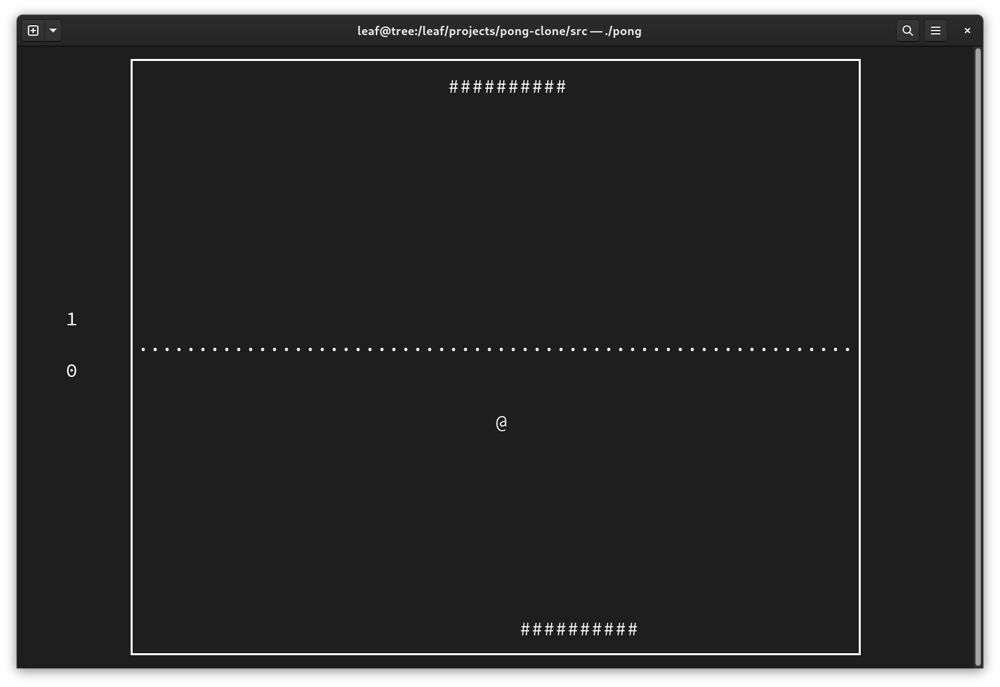

# Gameplay


# Installation
Binary downloads of the game can be found on [the Releases page](https://github.com/bimzhanovt/pong-clone/releases).

To build the program, you will need `gcc`, `make` and development versions of the ncurses and c libraries installed on your system.

On Ubuntu, you can install the required packages by running the following commands:
```sh
$ sudo apt-get update
$ sudo apt-get install -y build-essential libncurses-dev libc6-dev
```

If you have these packages installed, navigate to the `src/` directory and run `make build` to build the program. Once the program has been successfully built, run `./pong` in your terminal to start playing.
